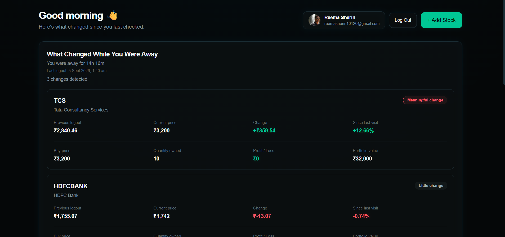
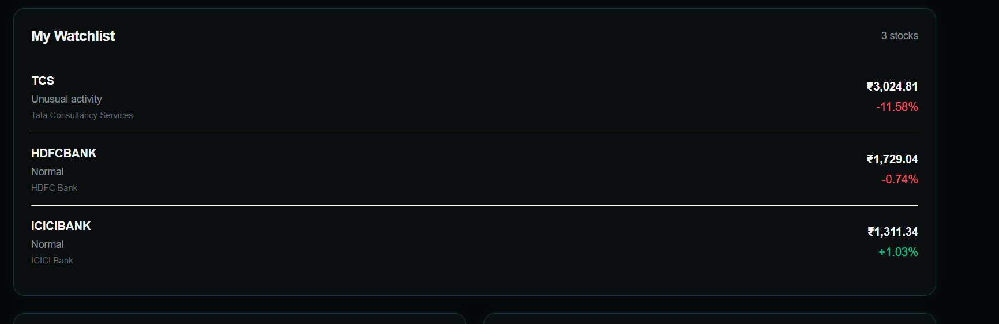
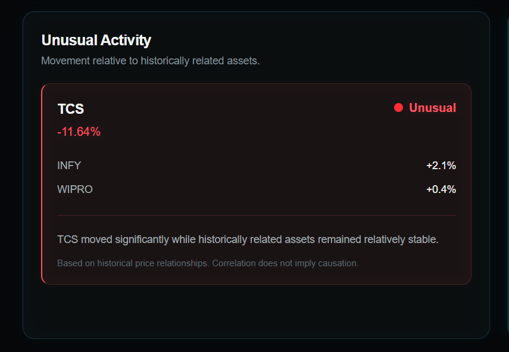
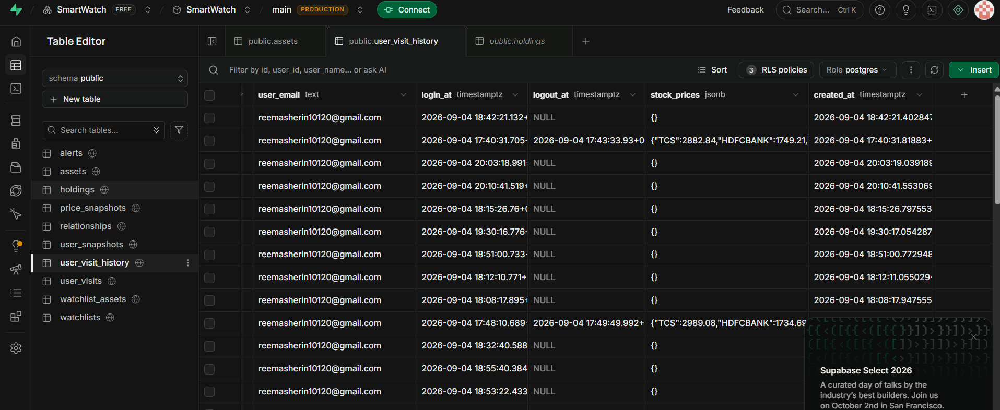

# SmartWatch

> WATCH → LEAVE → RETURN → DETECT → EXPLAIN
> ## Live Demo

🚀 **Try SmartWatch:** [Open the Live Demo](https://stock-smartwatch-eedfvhv19-riya10120.vercel.app/)

SmartWatch is a smart market watchlist built around one simple question:

> What meaningfully changed since I last checked?

Instead of simply showing stock prices, SmartWatch remembers what the market looked like when the user left, compares it with the latest state when they return, adds personal holdings context, surfaces market news, and identifies unusual movements between historically related assets.

## 100-Word Product Pitch

SmartWatch is a market watchlist built around one simple question: “What changed since I last checked?” Instead of making users scan a dashboard, it remembers their previous visit, compares prices when they return, connects movements to their holdings, and highlights unusual behaviour. Its most distinctive idea is relationship-based activity detection: if a stock suddenly moves very differently from assets it historically moves with, SmartWatch surfaces that divergence and explains the evidence. I chose this approach after talking to stock-app users and focusing on attention rather than prediction. SmartWatch is an early-stage prototype exploring a clearer way to understand markets simply.


## Why I Built This

I personally did not come from a stock-market background.

So instead of starting with assumptions about what a trading application should look like, I asked friends who regularly use stock-market applications:

- What do you look at first when you open the app again?
- What information helps you understand whether something actually changed?
- What do you wish your current stock app showed you?
- What makes you ignore most of the information on the screen?

A common pattern was that stock applications provide a lot of information, but users still have to figure out:

> What actually changed since I was here last time?

That became the starting point for SmartWatch.

I wanted to build something that did not try to replace a complete trading platform.

Instead, I focused on one smaller problem:

> Help the user decide what deserves their attention right now.

## Product Screenshots

## How to Use SmartWatch

1. **Create an account or log in**
   - Sign up using email or continue with Google/GitHub.
   - After authentication, you will be taken to the dashboard.

2. **Create your watchlist**
   - Use **Add Stock** to add assets you want to follow.
   - Your watchlist is saved to your account and remains available when you return.

3. **Add holding details (optional)**
   - For a stock you own, enter your **buy price** and **quantity**.
   - SmartWatch will show estimated current value and profit/loss.

4. **Leave and return later**
   - Log out after checking your watchlist.
   - When you log in again, SmartWatch compares the current market state with your previous visit.

5. **Check "What Changed"**
   - Start with **What Changed While You Were Away**.
   - Review previous price, current price, percentage movement, time away, and holding context.

6. **Check Unusual Activity**
   - Look for stocks behaving differently from historically related assets.
   - For example, TCS may fall sharply while Infosys, Wipro, and NIFTY IT remain stable.

7. **Read the latest market news**
   - Scroll to **Latest News** for recent market-related headlines.
   - Click a headline to open the original article.
   - Use **View all news** to expand the list.

### Recommended Demo Flow

For the best demonstration of the core idea:

**Login → Add TCS → Add holding details → Check dashboard → Logout → Log in again → View "What Changed" → Check Unusual Activity → Read Latest News**

The market simulator creates changing prices during the prototype demo, making it possible to observe meaningful movements and relationship-based divergence.

### Dashboard — What Changed



Screenshot: The main SmartWatch dashboard showing “What Changed While You Were Away”, the watchlist, unusual activity, and latest news.

The dashboard is intentionally organized around attention rather than information overload.

The first thing the user sees is what changed since their previous visit.

# Features

## 1. Personalized Watchlist

Users can create their own watchlist.

They can:

- Add stocks
- Remove stocks
- Store their watchlist persistently
- Return later and see the same assets

Watchlist information is stored in Supabase PostgreSQL.



Screenshot: The My Watchlist section showing the user's selected stocks.

## 2. Since Last Visit

This is the core feature of SmartWatch.

When a user leaves the application, SmartWatch remembers the market state from their visit.

When the user returns, SmartWatch compares the previous state with the current state and highlights what has changed.

The dashboard can show:

- Previous price
- Current price
- Percentage movement
- Price difference
- Time since the previous visit
- Whether the movement is meaningful
- Estimated profit/loss when the user has a holding

### Example

Imagine a user previously checked TCS at:

    TCS
    Previous price: ₹3,200

When they return later, SmartWatch sees:

    TCS
    Previous price: ₹3,200
    Current price: ₹3,421
    Change: +6.91%

Instead of making the user remember the old price, SmartWatch highlights the change:

    TCS

    Previous: ₹3,200
    Current:  ₹3,421

    +6.91%

    Meaningful change detected

This gives the user an immediate answer to:

> What changed since I last checked?

### Why This Matters

Most market dashboards continuously show the latest numbers, but the user still has to remember what those numbers looked like the last time they opened the application.

SmartWatch makes that comparison part of the product.

The user does not have to manually remember:

> What was TCS trading at when I last checked?

Instead, SmartWatch provides:

    Last visit → Current visit → Difference

This creates the core product loop:

WATCH → LEAVE → RETURN → DETECT → EXPLAIN


Screenshot: “What Changed While You Were Away” showing the previous price, current price, percentage change, time away, and holding context.

## 3. Holdings & Personal Context

I also wanted the application to answer another question:

> Does this movement actually matter to me?

Users can enter:

- Buy price
- Quantity

SmartWatch then calculates simple portfolio context.

For example:

    Buy price: ₹3,200
    Quantity: 10
    Current price: ₹3,421

    Estimated P/L:
    (₹3,421 - ₹3,200) × 10

    = ₹2,210

This is an estimated profit/loss, not a prediction or guaranteed return.

It simply gives the user context about how the current market price relates to their recorded holding.

A percentage movement can be interesting, but it does not tell every user the same story.

A 5% movement in a stock someone does not own may be less personally important than a smaller movement in a stock they hold heavily.

So SmartWatch connects market movement with personal context.


Screenshot: A stock showing buy price, quantity, current value, and estimated P/L.

## 4. Relationship-Based Unusual Activity

This is the part of SmartWatch I wanted to make different from a normal stock watchlist.

A large price movement does not automatically mean something is unusual.

For example, if the entire IT sector is moving down, TCS falling may not be surprising.

But imagine:

    TCS          -5.2%
    Infosys      +2.1%
    Wipro        +0.4%
    NIFTY IT     +1.0%

TCS is moving very differently from other assets that it has historically moved with.

SmartWatch can surface this as:

    ⚠ Unusual Activity

    TCS is moving differently from its
    historically related IT assets.

    TCS       -5.2%
    Infosys   +2.1%   | correlation: 0.84
    Wipro     +0.4%   | correlation: 0.79
    NIFTY IT  +1.0%   | correlation: 0.88

### In Simple Terms

Think of it like this:

If two things normally move together, but one suddenly behaves very differently, that difference is worth looking at.

For example:

    Normally:

    TCS       ↑
    Infosys   ↑
    Wipro     ↑

    But now:

    TCS       ↓↓↓
    Infosys   ↑
    Wipro     →

SmartWatch says:

> Something about TCS's movement is different from its usual relationship with these assets.

It does not say:

> TCS will fall further.

It does not predict the future.

It simply identifies an unusual relationship pattern and gives the user evidence to investigate.

### Relationship Example

For the prototype, the system uses historical relationships such as:

| Relationship | Historical Correlation |
|---|---:|
| TCS ↔ Infosys | 0.84 |
| TCS ↔ Wipro | 0.79 |
| TCS ↔ NIFTY IT | 0.88 |

These relationships can represent different types of connections in a larger version of the system, including:

- Historical price correlation
- Business relationships
- Ownership/issuer relationships
- Underlying asset relationships
- Market/index relationships

The important idea is that SmartWatch does not assume:

> Same sector = same relationship.

Instead, the relationship should have evidence behind it.



Screenshot: Unusual Activity card showing TCS diverging from Infosys, Wipro, and NIFTY IT.

## 5. Latest Market News

SmartWatch also connects the watchlist experience with current market news.

The application retrieves market-related news through a server-side API route.

Users can:

- See recent headlines
- Open the original article
- Expand the news section
- View additional stories

The goal is not to generate a prediction from the news.

Instead, news provides another piece of context when something changes.


Screenshot: Latest News section with clickable market headlines.

## 6. Explainable Signals

SmartWatch is designed as a market-awareness tool, not a trading prediction system.

It focuses on:

- Observation
- Context
- Comparison
- Historical relationships
- Anomaly detection

It does not attempt to predict future stock prices.

## How I Came Up With the Detection Idea

The idea for relationship-based activity came from thinking about how people actually interpret markets.

A stock moving 5% is not necessarily unusual if the whole sector is moving in the same direction.

But if one stock suddenly moves very differently from the assets it normally moves with, that difference becomes more interesting.

That led me to the idea of comparing a stock with related assets rather than looking at the stock completely by itself.

For the prototype, I used relationships such as TCS with Infosys, Wipro, and the NIFTY IT index.

The system then looks for divergence and surfaces it as unusual activity.

This was a deliberate choice to make the signal understandable instead of creating a black-box prediction.

Correlation indicates historical co-movement; it does not prove that one asset caused another asset to move.


# Dashboard

The dashboard is intentionally lightweight and organized around attention:

1. What Changed While You Were Away
2. My Watchlist
3. Unusual Activity
4. Latest News

The interface uses a dark futuristic fintech design with subtle blue electronic-style borders and green/red market signals.

# Technology Stack

- Next.js
- React
- TypeScript
- Tailwind CSS
- Supabase
  - Authentication
  - PostgreSQL database
  - Row Level Security
- NewsAPI
- Client-side market simulation for the hackathon prototype

# Architecture & Workflow

SmartWatch follows a user-first workflow. The process starts when a user creates an account or logs in and continues through authentication, loading their personal market context, comparing their previous visit, detecting unusual activity, and presenting the results on the dashboard.

```text
                         USER
                           |
                           v
              +-------------------------+
              |   LOGIN / CREATE ACCOUNT|
              |                         |
              |   • Google Login        |
              |   • GitHub Login        |
              |   • Account Sign Up     |
              +------------+------------+
                           |
                           v
              +-------------------------+
              |  SUPABASE AUTHENTICATION|
              |                         |
              |  Verify authenticated   |
              |       user              |
              +------------+------------+
                           |
                           v
              +-------------------------+
              |     LOAD USER DATA      |
              |                         |
              |  • Watchlist            |
              |  • Holdings             |
              |  • Previous Visit       |
              |    History              |
              +------------+------------+
                           |
                           v
              +-------------------------+
              |   GET MARKET CONTEXT    |
              |                         |
              |  • Current prices       |
              |  • Market movements     |
              |  • Related assets       |
              |  • Latest market news   |
              +------------+------------+
                           |
              +------------+------------+
              |                         |
              v                         v
      +---------------+         +---------------+
      |     MARKET    |         |   NEWS API    |
      |   SIMULATOR   |         |               |
      |               |         | Latest market |
      | Demo price    |         | news          |
      | movements     |         |               |
      +-------+-------+         +-------+-------+
              |                         |
              +------------+------------+
                           |
                           v
              +-------------------------+
              |   SMARTWATCH ENGINE     |
              |                         |
              |  Previous Visit         |
              |       ↓                 |
              |  Compare Prices         |
              |       ↓                 |
              |  Detect Movement        |
              |       ↓                 |
              |  Check Relationships    |
              |       ↓                 |
              |  Detect Divergence      |
              |       ↓                 |
              |  Add Holdings Context   |
              |       ↓                 |
              |  Add News Context       |
              +------------+------------+
                           |
                           v
              +-------------------------+
              |      DASHBOARD          |
              |                         |
              |  1. What Changed        |
              |  2. My Watchlist        |
              |  3. Unusual Activity    |
              |  4. Latest News         |
              +------------+------------+
                           |
                           v
                         USER
   ```
## Database

SmartWatch uses **Supabase PostgreSQL** to store the data required for a personalized and stateful market-watch experience.

The database supports the core product loop:

**WATCH → LEAVE → RETURN → DETECT → EXPLAIN**

### Database Structure

The main tables used by SmartWatch are:

| Table | Purpose |
|---|---|
| `watchlists` | Stores each user's watchlist |
| `assets` | Stores stocks, ETFs, and market assets |
| `watchlist_assets` | Connects assets to a user's watchlist |
| `holdings` | Stores buy price and quantity for portfolio context |
| `user_visit_history` | Stores previous login/logout sessions and market snapshots |
| `price_snapshots` | Stores observed price and volume information |
| `relationships` | Stores relationships between assets, including historical correlation |
| `alerts` | Stores meaningful or unusual market activity |



# Challenges I Faced

Building SmartWatch in a short hackathon timeframe came with several challenges. Some of the most important parts of the project were not just writing the code, but finding practical solutions when the original approach was not reliable enough for a working demo.

## Challenge 1 — Understanding What the Product Should Actually Solve

I did not start this project with a deep stock-market background.

Instead, I first spoke with friends who regularly use stock-market applications and asked them what they normally look at when they return to an app and what information they wish was easier to understand.

That conversation led me to focus on a simple problem:

> What actually changed since I last checked?

This became the foundation of SmartWatch and led to the "Since Last Visit" feature.

I then asked a second question:

> What if the application could also tell me when a stock is behaving differently from the assets it normally moves with?

That led to the relationship-based unusual activity feature.

Rather than trying to build another application that simply displays more market information, I decided to build around attention and context.

---

## Challenge 2 — Getting Real-Time Stock Market Data

One of the biggest technical challenges was finding a reliable source of real-time stock prices that could be used freely during the hackathon.

The free market-data options I explored had limitations such as delayed data, request limits, API quotas, or inconsistent availability.

This created a problem for the demo.

If the stock prices did not change reliably, it would be difficult to demonstrate the "Since Last Visit" and "Unusual Activity" features.

### What I Did

Instead of making the entire prototype dependent on an unreliable free real-time data source, I created a small market simulator.

The simulator generates changing stock prices on a regular interval and can create controlled movements for the demo.

For example, TCS can experience a stronger movement while related IT assets remain relatively stable.

This makes it possible to demonstrate the core idea consistently.

The simulator is clearly treated as prototype/demo market data and is not presented as a live exchange feed.

---

## Challenge 3 — Making "Since Last Visit" Actually Work

At first, simply displaying current prices was not enough.

The main idea of SmartWatch depends on remembering what the user saw before leaving the application.

Normal client-side state is not enough for this because the information needs to persist between visits.

### What I Did

I created a persistent visit-history system using Supabase.

When a user starts a visit, SmartWatch retrieves the most recent completed visit and its stored stock prices.

The application then creates a new visit and uses the previous state as the comparison point.

The flow became:

    User logs in
        ↓
    Previous visit retrieved
        ↓
    Previous stock prices loaded
        ↓
    New visit created
        ↓
    Current market state compared
        ↓
    Changes displayed

This is what allows the dashboard to answer:

> What changed while you were away?

instead of simply showing the latest stock price.

---

## Challenge 4 — Making the Unusual Activity Idea Explainable

Another challenge was deciding how to identify something as "unusual."

A stock moving by 5% does not automatically mean something unusual happened.

For example, if the entire IT sector moves down together, a large movement in TCS may simply be part of the broader market movement.

So I experimented with the idea of comparing an asset with other assets it historically moves with.

For the prototype, I used relationships such as:

    TCS ↔ Infosys
    TCS ↔ Wipro
    TCS ↔ NIFTY IT

with example historical correlation strengths.

If TCS moves sharply while those related assets remain relatively stable, SmartWatch can highlight the divergence.

The challenge was keeping this understandable.

I therefore chose an explainable approach where the user can see the asset movement, the related assets, and the relationship strength instead of receiving an unexplained "AI alert."

Correlation is treated as evidence of historical co-movement, not proof that one asset caused another to move.

---

## Challenge 5 — Connecting Market Movement to the User

Another question I wanted to answer was:

> Does this market movement actually matter to the user?

A percentage change by itself does not tell the whole story.

Someone may see a stock move 5%, but if they do not own it, the movement may not be personally important.

So I added a simple holdings system where users can enter:

    Buy price
    Quantity

SmartWatch then calculates estimated profit/loss from the current price.

For example:

    Buy price: ₹3,200
    Quantity: 10
    Current price: ₹3,421

    Estimated P/L:
    (₹3,421 - ₹3,200) × 10

    = ₹2,210

This adds personal context without trying to make investment recommendations.

---

## Challenge 6 — Deploying the Application

The application worked locally, but getting the production version running introduced another set of problems.

The first production build failed because TypeScript detected that the authenticated user could potentially be null in some parts of the dashboard.

I fixed this by making the authenticated user state explicit before using user-specific operations.

After that, the Vercel production build reached another issue:

    supabaseUrl is required

The application needed the production environment variables that were available locally but had not yet been configured in Vercel.

I added the required Supabase and News API environment variables to the Vercel project and redeployed.

Environment variables are configured separately for deployments in Vercel, rather than being committed to the repository. :contentReference[oaicite:0]{index=0}

---

## Challenge 7 — OAuth Redirects After Deployment

After the application was successfully deployed, authentication introduced another production-specific issue.

Google login was initially returning to the local development URL instead of the production application.

The problem was that the Supabase authentication URL configuration was still using:

    http://localhost:3000

I updated the Supabase Site URL and allowed redirect URLs to include the production Vercel URL while keeping the local development URL available.

After this change, the OAuth flow correctly returned users to the production application.

This was another reminder that authentication configuration needs to be tested separately in development and production.

---

## What These Challenges Taught Me

The biggest lesson from building SmartWatch was that building a working product is not only about implementing features.

It also involves making practical decisions when external dependencies, data sources, authentication, or deployment environments do not behave exactly as expected.

Instead of removing features when I encountered these problems, I tried to find solutions that preserved the core product idea while being honest about the limitations of the prototype.

That is why the current version uses:

- Persistent Supabase data for user state
- A controlled market simulator for demo market movement
- Explainable relationship-based signals
- Server-side news retrieval
- Production environment configuration
- Supabase authentication

The result is an early-stage prototype that demonstrates the core SmartWatch experience while leaving clear areas for future improvement.

## Future Improvements & Final Thoughts

With more time, I would replace the market simulator with reliable real-time data, improve automatic relationship detection, add smarter news analysis, and introduce personalized alerts. SmartWatch is still an early prototype, but the main idea is simple: instead of making users search through numbers and charts, it remembers what they saw before and tells them what meaningfully changed, what looks unusual, and why it deserves attention. I could build it even better with more time, but this prototype demonstrates the core idea within the hackathon timeframe.
